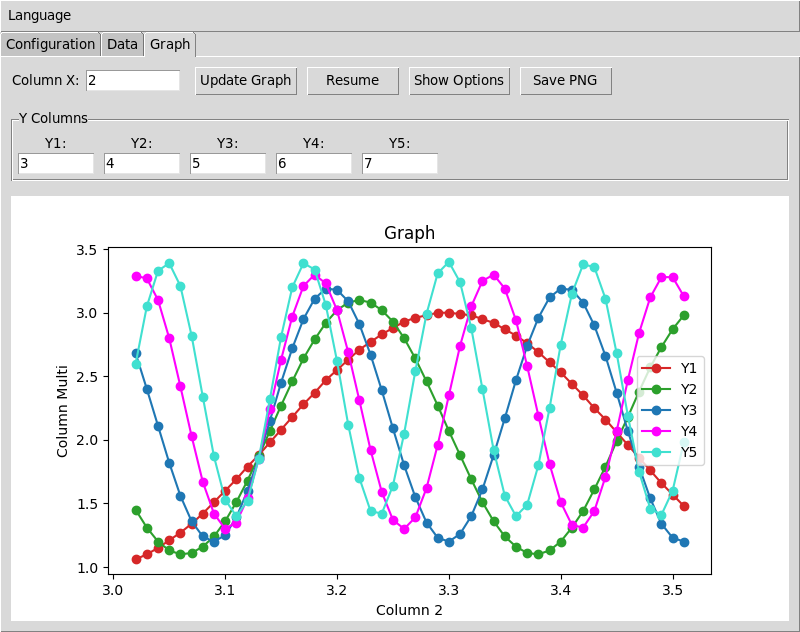
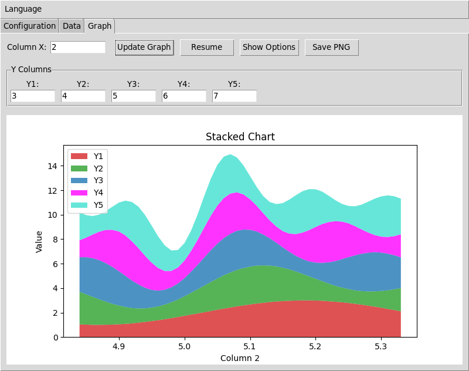

# lim_bal - Communication Série & Visualisation de Données

**README en :** [English](../README.md) | [Português](README_pt-br.md) | [Español](README_es.md) | [Deutsch](README_de.md) | [Français](README_fr.md)

---

## Aperçu

lim_bal est une application de bureau pour la communication série et la visualisation des données en temps réel. Connectez-vous à Arduino ou à d'autres appareils série, collectez des mesures numériques et créez des graphiques. L'interface est disponible en cinq langues.





## Fonctionnalités

### 🌍 **Langues Multiples**
- Disponible en anglais, portugais, espagnol, allemand et français
- Changement de langue depuis le menu (redémarrage requis)
- Tous les paramètres conservés lors du changement de langue

### 📡 **Connexion Série Facile**
- Connexion aux appareils série réels (Arduino, capteurs, etc.)
- Mode simulation intégré pour tester sans matériel
- Détection automatique des ports avec actualisation en un clic
- Compatibilité complète avec les débits de l'IDE Arduino (300-2000000 bps)
- Débit par défaut : 9600 ; commandes rapides : SI, SIR, Zerar et Tara
- Les commandes texte personnalisées sont envoyées avec CRLF

### 📊 **Visualisation de Données Professionnelle**
- **Graphiques de Séries Temporelles** : Tracez jusqu'à 5 colonnes de données simultanément
- **Graphiques en Aires Empilées** : Comparez les données en valeurs absolues ou en pourcentages
- **Apparence Personnalisable** : Choisissez les couleurs, marqueurs et types de lignes pour chaque série de données
- **Mises à Jour en Temps Réel** : Taux de rafraîchissement configurables (1-30 FPS)
- **Export** : Sauvegardez les graphiques en images PNG haute qualité
- **Contrôles Interactifs** : Pausez/reprenez la collecte de données, zoomez et déplacez-vous

### 💾 **Gestion de Données Intelligente**
- **Sauvegarde/Chargement Manuel** : Exportez et importez vos données à tout moment
- **Sauvegarde Automatique** : Sauvegarde automatique optionnelle avec noms de fichiers horodatés
- **Sécurité des Données** : Effacez les données avec invites de confirmation
- **Tous les Paramètres Sauvegardés** : Les préférences sont automatiquement conservées entre les sessions
- **Plot data** : Contrôle l'enregistrement et le tracé des mesures numériques dans Data
- **Receive data** : Affiche chaque ligne reçue avec compteur et temps écoulé

## Premiers Pas

### Prérequis
- Python 3.7 ou plus récent
- Connexion Internet pour l'installation des dépendances

### Installation
```bash
# Installer les packages requis
pip install matplotlib pyserial PyYAML

# Cloner et exécuter LimBal00
git clone https://github.com/ChiaroZ80/LimBal00.git
cd LimBal00
python lim_bal.py
```

### Premiers Pas
1. **Langue** : Choisissez votre langue dans le menu Langue
2. **Connexion** : Dans Configuration, sélectionnez le port et le débit puis connectez l'appareil
3. **Réception** : Consultez les lignes et le temps écoulé dans Receive data
4. **Données** : Activez Plot data pour enregistrer les mesures numériques dans Data
5. **Visualisation** : Créez des graphiques ou envoyez des commandes depuis Graph

## Utilisation

### Onglet Configuration
- **Mode** : Choisissez "Hardware" pour les appareils réels, "Simulated" pour les tests
- **Port** : Sélectionnez votre port série (cliquez sur Actualiser pour mettre à jour la liste)
- **Débit** : Définissez la vitesse (par défaut : 9600)
- **Plot data** : Active ou désactive l'enregistrement des mesures numériques dans Data
- **SI / SIR / Zerar / Tara** : Envoie la commande correspondante à l'appareil
- **Send data** : Envoie du texte personnalisé suivi de CRLF
- **Receive data** : Affiche les lignes avec compteur et secondes depuis la connexion
- **Connecter / Déconnecter** : Démarre ou termine la connexion matérielle

### Onglet Données
- **Voir les Données** : Consultez compteur, temps et mesures numériques lorsque Plot data est actif
- **Sauvegarder les Données** : Exportez les données actuelles vers un fichier texte
- **Charger les Données** : Importez des fichiers de données précédemment sauvegardés
- **Effacer les Données** : Réinitialisez le jeu de données actuel (avec confirmation)
- **Sauvegarde Auto** : Activez/désactivez la sauvegarde automatique avec noms de fichiers horodatés

### Onglet Graphique
- **Choisir les Colonnes** : Sélectionnez l'axe X et jusqu'à 5 colonnes d'axe Y de vos données
- **Types de Graphiques** :
  - **Séries Temporelles** : Graphiques linéaires/nuages de points individuels pour chaque série de données
  - **Aires Empilées** : Graphiques en couches montrant des données cumulatives ou des pourcentages
- **Personnaliser** : Développez "Afficher les Options Avancées" pour changer couleurs, marqueurs, taux de rafraîchissement
- **Export** : Sauvegardez vos graphiques en images PNG
- **Contrôle** : Pausez/reprenez les mises à jour temps réel à tout moment
- **SI / SIR** : Envoie des commandes depuis l'onglet Graph
- **Stop** : Envoie `@` avec CRLF ; la prochaine ligne n'est pas enregistrée dans Data, mais reste visible dans Receive data

### Menu Langue
- **Changer de Langue** : Sélectionnez parmi 5 langues disponibles
- **Redémarrage Requis** : L'application vous invitera à redémarrer pour le changement de langue
- **Paramètres Conservés** : Toutes vos préférences sont gardées lors du changement de langue

## Format des Données

Votre appareil série doit envoyer des données en format texte simple :

```
# Lignes de données numériques (séparées par des espaces ou tabulations)
1.0 3.3 0.125 25.4
2.0 3.2 0.130 25.6
3.0 3.4 0.122 25.2
```

**Formats supportés :**
- Colonnes séparées par des espaces ou tabulations
- Nombres dans n'importe quelle colonne
- Les lignes de protocole/état sans mesures ne sont pas ajoutées à Data
- Streaming temps réel ou chargement de données par lots

## Dépannage

**Problèmes de Connexion :**
- Assurez-vous que votre appareil est connecté et sous tension
- Vérifiez qu'aucun autre programme n'utilise le port série
- Essayez différents débits si les données apparaissent corrompues
- Utilisez le mode Simulé pour tester l'interface sans matériel

**Problèmes de Données :**
- Assurez-vous que les données sont séparées par des espaces ou tabulations
- Vérifiez que les nombres sont en format standard (utilisez . pour les décimales)
- Vérifiez que votre appareil envoie des données en continu
- Essayez de sauvegarder et recharger les données pour vérifier le format

**Performance :**
- Réduisez le taux de rafraîchissement si les graphiques sont lents
- Réduisez la taille de la fenêtre de données pour de meilleures performances
- Fermez d'autres programmes si le système devient non réactif

## Développement

Cette application est construite avec Python et utilise tkinter pour l'interface et matplotlib pour les graphiques.

**Pour les développeurs :**
- La base de code utilise une architecture modulaire avec des composants séparés pour l'interface utilisateur, la gestion des données et la visualisation
- Les traductions sont stockées dans des fichiers YAML dans le répertoire `languages/`
- La configuration utilise un système de préférences hiérarchique sauvegardé dans `config/prefs.yml`
- Le système de rafraîchissement des graphiques est découplé de l'arrivée des données pour une performance optimale

## Licence

Développé par CBPF-LIM (Centre Brésilien de Recherche en Physique - Laboratoire Lumière et Matière).

---

**lim_bal** - Communication série et visualisation des données.
